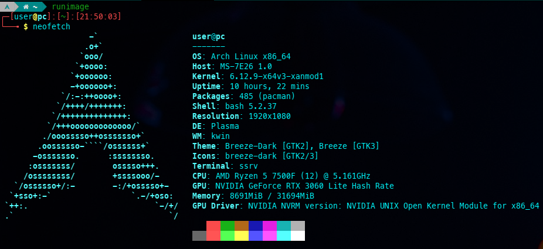

# RunImage

## **Portable single-file Linux container in unprivileged user namespaces**



RunImage is designed to be completely static and portable to run on almost any Linux distribution. It is based on a specially configured [Arch Linux rootfs](https://github.com/VHSgunzo/runimage-rootfs). The technology of single-file containerization is based on [unprivileged user namespaces](https://lwn.net/Articles/531114) and works with a [uruntime](https://github.com/VHSgunzo/runimage-runtime-static), [DwarFS](https://github.com/mhx/dwarfs) (or [SquashFS](https://docs.kernel.org/filesystems/squashfs.html)) image, statically compiled [binaries](https://github.com/VHSgunzo/runimage-static) and [sharun](https://github.com/VHSgunzo/sharun) for the operation of the container [Run.sh script](https://github.com/VHSgunzo/runimage/blob/main/rootfs/var/RunDir/Run.sh), and containerization itself is carried out by [statically compiled](https://github.com/VHSgunzo/bubblewrap-static/releases) [Bubblewrap](https://github.com/containers/bubblewrap) with [tini](https://github.com/krallin/tini) as init and [ssrv](https://github.com/VHSgunzo/ssrv) as shell server/client.

In addition, RunImage has the ability to isolate itself from the main system, use separate portable or sandbox home directories and configuration files for each executable file, and has the ability to run separate X11 servers, including running multiple Xorg servers on TTY (XFCE is used as DE)

You can use it to develop or run any applications and games, including applications and games for Windows, launch games from retro platforms using popular emulators, work with the office, with remote desktops, multimedia, browsers, messengers, and even run virtual machines with QEMU/KVM and Virt-Manager, USB and block device forwarding in VM also works.

Also inside the container, you can use various means of proxification, such as proxychains, tor and others and run VNC and SSH servers.
In network sandbox mode you can use VPN (tested [openvpn](https://community.openvpn.net/openvpn), [wireguard](https://www.wireguard.com/), [sshuttle](https://github.com/sshuttle/sshuttle), [tun2proxy](https://github.com/blechschmidt/tun2proxy)) and other network tools without root rights.

The full list of installed packages can be found in the [**releases**](https://github.com/VHSgunzo/runimage/releases/continuous) file `pkg_list{-release-type}.txt`

## Features:

* Supports the `x86_64` and `aarch64` architectures.
* A portable single executable file with an idea - downloaded and launched. Nothing needs to be installed in the system.
* Works on most Linux distributions, including even very old ones or without glibc or systemd and in live boot mode.
* OverlayFS mode (It looks like the usual means of containerization like docker) (See [Usage](https://github.com/VHSgunzo/runimage#usage))
* Read-Write mount in OverlayFS mode.
* The ability to en/decrypt container rootfs
* Running and working without root rights, including package management.
* The ability to work in a packed and unpacked form.
* The ability to run both 32-bit and 64-bit executable files.
* Based on Arch Linux, contains the latest software and [AUR](https://aur.archlinux.org) support.
* Access to [BlackArch](https://github.com/BlackArch/blackarch) repo.
* Access to [Chaotic-AUR](https://aur.chaotic.cx) repo.
* Own Pacman [repository](https://runimage-repo.hf.space) with [mirror](https://github.com/runimage/repo).
* Updating without extraction runimage and automatic rebuild if the update was successful.
* The ability to launching AppImage applications with FUSE mount (not needed to extract).
* The ability to exec commands at the host level (see RIM_ENABLE_HOSTEXEC and [hostexec](https://github.com/VHSgunzo/runimage/blob/main/rootfs/var/RunDir/utils/hostexec))
* The ability to use both separate home directories for each executable file, and completely seamless use of the system home directory.
* The ability to use separate container configuration files for each launched executable file
* There is no performance drawdown. All applications and executable files run at the same speed as in the system
* The ability to Filesystem, X11, DBUS, UDEV, Network, SystemD, USERs and PIDs sandboxing.
* Port forwarding in sandbox network mode (TCP, UDP, SOCKS5 proxy and reverse mode supports).
* Temporary home directory in RAM (can be used as a real private mode for browsers and applications)
* Sandbox and portable home directory.
* The ability to launching a full DE in windowed/full screen mode and on TTY
* Works with any versions of nvidia proprietary drivers
* Works in Wayland session.
* Monitoring of running processes
* Background processes control
* The ability to execute commands in a single container or in specified container.
* The ability to start and control SystemD services with [fake-systemd](https://github.com/VHSgunzo/runimage-fake-systemd) package.
* The ability to use custom rootfs (alpine-based, debian-based, voidlinux-based supports)
* Usability and comprehensibility.

## Requirements:

* Supported architectures (should work on any Linux kernel architecture. However, it is currently only built for `x86_64` and `aarch64`)
* Minimum recommended Linux kernel version 4.18+ (tested on Centos 7 with 3.10 and on Ubuntu 12.04 with 3.11 using SUID Bubblewrap and it's works, but 5.0+ with [unprivileged user namespaces](https://lwn.net/Articles/531114) support is recommended)
* FUSE (but not necessarily, because it is possible to work in unpacked form without FUSE mounting). Also you can create /dev/fuse manually (as root) if the kernel module exists (see this [code](https://github.com/libfuse/libfuse/blob/f0e08cc700d629da2d46def8b620b0ed858cc0d9/util/install_helper.sh#L35)):
```
mknod /dev/fuse -m 0666 c 10 229
```

## To get started:

1. Download continuous release from the [**releases**](https://github.com/VHSgunzo/runimage/releases/continuous) page. ([HF mirror](https://huggingface.co/runimage/releases/tree/main/stable))
2. Make it executable before run.
```
chmod +x runimage
```

## Usage:

```
┌──[user@host]─[~]
└──╼ $ runimage {args} {executable} {executable args}

    rim-help                       Show this usage info
    rim-version                    Show RunImage, rootfs, static, runtime version
    rim-pkgls                      Show packages installed in RunImage
    rim-binls                      Show executables in RunImage
    rim-shell    {args}            Run RunImage shell or execute a command in RunImage shell
    rim-desktop  {args}            Launch RunImage desktop
    rim-ofsls                      Show the list of RunImage OverlayFS
    rim-ofsrm    {id id ...|all}   Remove OverlayFS
    rim-build    {args}            Build new RunImage container
    rim-update   {args}            Update packages and rebuild RunImage
    rim-kill     {RUNPIDs|all}     Kill running RunImage containers
    rim-psmon    {args} {RUNPIDs}  Monitoring of processes running in RunImage containers
    rim-exec     {RUNPID} {args}   Exec command in running container
    rim-portfw   {RUNPID} {args}   Forward additional ports
    rim-dinteg   {args}            Desktop integration
    rim-shrink   {args}            Shrink RunImage rootfs
    rim-bootstrap {pkg pkg}        Bootstrap new RunImage
    rim-encfs    {build args}      Encrypt RunImage rootfs
    rim-decfs    {build args}      Decrypt RunImage rootfs
    rim-enc-passwd {build args}    Change decrypt password for encrypted RunImage rootfs

Only for not extracted (RunImage runtime options):
    --runtime-extract {pattern}          Extract content from embedded filesystem image
    --runtime-extract-and-run {args}     Run RunImage after extraction without using FUSE
    --runtime-help                       Show RunImage runtime help
    --runtime-offset                     Print byte offset to start of embedded
    --runtime-portable-home              Create a portable home folder to use as $HOME
    --runtime-portable-config            Create a portable config folder to use as $XDG_CONFIG_HOME
    --runtime-version                    Print version of RunImage runtime
    --runtime-mount                      Mount embedded filesystem image and print
                                            mount point and wait for kill with Ctrl-C
    --runtime-squashfuse {args}          Launch squashfuse
    --runtime-unsquashfs {args}          Launch unsquashfs
    --runtime-mksquashfs {args}          Launch mksquashfs
    --runtime-dwarfs     {args}          Launch dwarfs
    --runtime-dwarfsck   {args}          Launch dwarfsck
    --runtime-mkdwarfs   {args}          Launch mkdwarfs
    --runtime-dwarfsextract {args}       Launch dwarfsextract

Configuration environment variables:
    RIM_ROOTFS=/path/rootfs                  Specifies custom rootfs (0 to disable)
    RIM_NO_NET=1                             Disables network access
    RIM_TMP_HOME=1                           Creates tmpfs /home/$USER and /root in RAM and uses it as $HOME
    RIM_TMP_HOME_DL=1                        As above, but with binding $HOME/Downloads dir
    RIM_SANDBOX_HOME=1                       Creates sandbox home dir
    RIM_SANDBOX_HOME_DL=1                    As above, but with binding $HOME/Downloads dir
    RIM_SANDBOX_HOME_DIR=/path/dir           Specifies sandbox home dir
    RIM_UNSHARE_HOME=1                       Unshares host home dir
    RIM_UNSHARE_HOME_DL=1                    As above, but with binding $HOME/Downloads dir
    RIM_PORTABLE_HOME=1                      Creates a portable home dir and uses it as $HOME
    RIM_PORTABLE_HOME_DIR=/path/dir          Specifies a portable home dir and uses it as $HOME
    RIM_PORTABLE_CONFIG=1                    Creates a portable config dir and uses it as $XDG_CONFIG_HOME
    RIM_NO_CLEANUP=1                         Disables unmounting and cleanup mountpoints
    RIM_UNSHARE_PIDS=1                       Unshares all host processes
    RIM_UNSHARE_USERS=1                      Don't bind-mount /etc/{passwd,group}
    RIM_UNSHARE_HOSTNAME=1                   Unshares UTS namespace and hostname
    RIM_UNSHARE_HOSTS=1                      Unshares host /etc/hosts
    RIM_UNSHARE_RESOLVCONF=1                 Unshares host /etc/resolv.conf
    RIM_UNSHARE_RUN=1                        Unshares host /run
    RIM_SHARE_SYSTEMD=1                      Shares host SystemD
    RIM_UNSHARE_DBUS=1                       Unshares host DBUS
    RIM_UNSHARE_UDEV=1                       Unshares host UDEV (/run/udev)
    RIM_UNSHARE_XDGRUN=1                     Unshares host $XDG_RUNTIME_DIR
    RIM_UNSHARE_XDGSOUND=1                   Unshares host $XDG_RUNTIME_DIR sound sockets
    RIM_UNSHARE_MODULES=1                    Unshares host kernel modules (/usr/lib/modules)
    RIM_UNSHARE_LOCALTIME=1                  Unshares host localtime (/etc/localtime)
    RIM_UNSHARE_NSS=1                        Unshares host NSS (/etc/nsswitch.conf)
    RIM_UNSHARE_TMP=1                        Unshares host /tmp
    RIM_UNSHARE_TMPX11UNIX=1                 Unshares host /tmp/.X11-unix
    RIM_UNSHARE_DEF_MOUNTS=1                 Unshares default mount points (/mnt /media /run/media)
    RIM_SHARE_BOOT=1                         Shares host /boot
    RIM_SHARE_ICONS=1                        Shares host /usr/share/icons
    RIM_SHARE_FONTS=1                        Shares host /usr/share/fonts
    RIM_SHARE_THEMES=1                       Shares host /usr/share/themes
    RIM_SHARE_PKGCACHE=1                     Shares host packages cache
    RIM_BIND=/path:/path,/path1:/path1       Binds specified paths to the container
    RIM_BIND_PWD=1                           Binds $PWD to the container
    RIM_NO_NVIDIA_CHECK=1                    Disables checking the nvidia driver version
    RIM_SYS_NVLIBS=1                         Try to use system Nvidia libraries
    RIM_NO_32BIT_NVLIBS_CHECK=1              Disable 32-bit Nvidia libraries check
    RIM_NVIDIA_DRIVERS_DIR=/path/dir         Specifies custom Nvidia driver images dir
    RIM_CACHEDIR=/path/dir                   Specifies custom RunImage cache dir
    RIM_OVERFSDIR=/path/dir                  Specifies custom RunImage OverlayFS dir
    RIM_OVERFS_MODE=1                        Enables OverlayFS mode
    RIM_NO_BWRAP_OVERLAY=1                   Disables Bubblewrap overlay for OverlayFS mode
    RIM_NO_CRYPTFS_MOUNT=1                   Disables mount encrypted RunImage rootfs
    RIM_KEEP_OVERFS=1                        Enables OverlayFS mode with saving after closing RunImage
    RIM_OVERFS_ID=ID                         Specifies the OverlayFS ID
    RIM_SHELL=shell                          Selects $SHELL in RunImage
    RIM_NO_CAP=1                             Disables Bubblewrap capabilities (Default: ALL, drop CAP_SYS_NICE)
                                                    you can also use nocap in RunImage
    RIM_AUTORUN='{executable} {args}'        Autorun mode for executable from PATH (0 to disable)
    RIM_RUN_IN_ONE=1                         Execute commands in one container
    RIM_ALLOW_ROOT=1                         Allows to run RunImage under root user
    RIM_QUIET_MODE=1                         Disables all non-error RunImage messages
    RIM_NO_WARN=1                            Disables all warning RunImage messages
    RIM_NOTIFY=1                             Enables non-error RunImage notification
    RUNTIME_EXTRACT_AND_RUN=1                Run RunImage after extraction without using FUSE
    TMPDIR=/path/TMPDIR                      Used for extract and run options
    RIM_CONFIG=/path/config.rcfg             RunImage сonfiguration file (0 to disable)
    RIM_ENABLE_HOSTEXEC=1                    Enables the ability to execute commands at the host level
    RIM_HOST_TOOLS=cmd,cmd                   Enables specified commands from the host (0 to disable)
    RIM_HOST_XDG_OPEN=1                      Enables xdg-open from the host
    RIM_NO_RPIDSMON=1                        Disables the monitoring thread of running processes
    RIM_WAIT_RPIDS_EXIT=1                    Wait for all processes to exit
    RIM_EXEC_SAME_PWD=1                      Use same $PWD for rim-exec and hostexec
    RIM_SANDBOX_NET=1                        Creates a network sandbox
    RIM_SNET_SHARE_HOST=1                    Creates a network sandbox with access to host loopback
    RIM_SNET_CIDR=11.22.33.0/24              Specifies TAP iface subnet in network sandbox (Def: 10.0.2.0/24)
    RIM_SNET_TAPNAME=tap0                    Specifies TAP iface name in network sandbox (Def: eth0)
    RIM_SNET_MAC=B6:40:E0:8B:A6:D7           Specifies TAP iface MAC in network sandbox (Def: random)
    RIM_SNET_MTU=65520                       Specifies TAP iface MTU in network sandbox (Def: 1500)
    RIM_SNET_TAPIP=11.22.33.44               For set TAP iface IP in network sandbox mode (Def: 10.0.2.100)
    RIM_SNET_PORTFW='2222:22 R:53:53/UDP'    Enables port forwarding in network sandbox mode (1 to enable)
    RIM_SNET_DROP_CIDRS=1                    Drop access to host CIDR's in network sandbox mode
    RIM_HOSTS_FILE=/path/hosts               Binds specified file to /etc/hosts (0 to disable)
    RIM_RESOLVCONF_FILE=/path/resolv.conf    Binds specified file to /etc/resolv.conf (0 to disable)
    RIM_BWRAP_ARGS+=()                       Array with Bubblewrap arguments (for config file)
    RIM_EXEC_ARGS+=()                        Array with Bubblewrap exec arguments (for config file)
    RIM_CRYPTFS_PASSFILE=/path/passfile      Specifies passfile for decrypt encrypted RunImage rootfs
    RIM_XORG_CONF=/path/xorg.conf            Binds xorg.conf to /etc/X11/xorg.conf in RunImage (0 to disable)
                                                    (Default: /etc/X11/xorg.conf bind from the system)
    RIM_SYS_TOOLS=1                          Use all binaries from the system
                                                If they are not found in the system - auto return to the built-in
    rim-build:
    RIM_KEEP_OLD_BUILD=1                     Creates a backup of the old RunImage when building a new one
    RIM_CMPRS_FS={sqfs|dwfs}                 Specifies the compression filesystem for RunImage build
    RIM_CMPRS_BSIZE={1M|20}                  Specifies the compression filesystem block size for RunImage build
    RIM_CMPRS_ALGO={zstd|xz|lz4}             Specifies the compression algo for RunImage build
    RIM_CMPRS_LVL={1-22|1-9|1-12}            Specifies the compression ratio for RunImage build
    rim-update:
    RIM_UPDATE_SHRINK=1                      Run rim-shrink --all after update
    RIM_UPDATE_CLEANUP=1                     Run rim-shrink --pkgcache after update
    rim-dinteg:
    RIM_DINTEG=1                             Enables desktop integration pacman hook
    RIM_DINTEG_MIME=1                        Desktop integration with MIME types
    rim-desktop:
    RIM_XEPHYR_SIZE=HEIGHTxWIDTH             Sets RunImage desktop resolution (Default: 1600x900)
    RIM_DESKTOP_DISPLAY=9999                 Sets RunImage desktop $DISPLAY (Default: 1337)
    RIM_XEPHYR_FULLSCREEN=1                  Starts RunImage desktop in full screen mode
    RIM_DESKTOP_UNCLIP=1                     Disables clipboard synchronization for RunImage desktop
    rim-shrink:
    RIM_SHRINK_ALL=1                         Shrink all
    RIM_SHRINK_BACK=1                        Shrink backup files '*.old' '*.back'
    RIM_SHRINK_STATICLIBS=1                  Shrink static libs '*.a'
    RIM_SHRINK_DOCS=1                        Shrink /usr/share/{man,doc,help,info,gtk-doc} and '*.md' 'README*'
    RIM_SHRINK_STRIP=1                       Strip all debugging symbols & sections
    RIM_SHRINK_LOCALES=1                     Shrink all locales except uk ru en en_US
    RIM_SHRINK_OBJECTS=1                     Shrink object files '*.o'
    RIM_SHRINK_PKGCACHE=1                    Shrink packages cache
    RIM_SHRINK_SRC=1                         Shrink source code files for build
    RIM_SHRINK_PYCACHE=1                     Shrink '__pycache__' directories
```
## Other environment variables at runtime:
|||
|---|---|
|INSIDE_RUNIMAGE=1                      |      If inside RunImage                     |
|RUNIMAGE=/path/runimage                |      RunImage path (for packed)             |
|RUNOFFSET=1234                         |      Image offset (for packed)              |
|ARG0=runimage                          |      Null argument                          |
|RUNPID=1234                            |      PID of Run.sh script                   |
|RUNPPID=1233                           |      Parent PID of Run.sh script            |
|RUNDIR=/path/RunDir                    |      Run binary directory                   |
|RUNROOTFS=/path/rootfs                 |      RootFS directory                       | 
|RUNSTATIC=/path/static                 |      Static binaries directory              |
|RUNIMAGEDIR=/path/dir                  |      RunImage or RunDir directory           |
|RUNCONFIGDIR=/path/config              |      RunImage external configs directory    |
|SANDBOXHOMEDIR=/path/sandbox-home      |      Sandbox homes directory                |
|PORTABLEHOMEDIR=/path/portable-home    |      Portable homes directory               |
|RUNCACHEDIR=/path/cache                |      Cache directory                        |
|NVIDIA_DRIVERS_DIR=/path/nvidia-drivers|      Nvidia driver images directory         |
|RUNSRCNAME=runimage                    |      RunImage or link or executable name    |
|RUNIMAGE_VERSION=1.2.3                 |      RunImage version                       |
|RUNROOTFS_VERSION=1.2.3                |      RootFS version                         |
|RUNSTATIC_VERSION=1.2.3                |      Static version                         |
|RUNRUNTIME_VERSION=1.2.3               |      RunImage runtime version               |
|RUNOVERFSDIR=/path/overlayfs           |      Directory for all OverlayFS            |
|OVERFS_DIR=/path/overlayfs/id          |      OverlayFS ID directory                 |
|OVERFS_MNT=/path/overlayfs/id/mnt      |      OverlayFS ID mount directory           |
|RUNRUNTIME=/path/uruntime              |      RunImage runtime                       |
|RUNROOTFSTYPE=base                     |      Rootfs type                            |
|FUSE_PIDS=1235                         |      PIDs of all RunImage FUSE tools        |
|RUNUSER=user                           |      The name of the user who runs RunImage |
|REUIDDIR=/tmp/.r$EUID                  |      RunImage EUID working directory        |
|RUNTMPDIR=$REUIDDIR/run                |      RunImage RUNPIDs working directory     |
|RUNPIDDIR=$RUNTMPDIR/$RUNPID           |      RunImage RUNPID working directory      |
|BWINFFL=$RUNPIDDIR/bwinf               |      Bubblewrap info file                   |
|RIMENVFL=$RUNPIDDIR/rimenv             |      RIM environment variables file         |
|RUNDIRFL=$RUNPIDDIR/rundir             |      RunImage RunDir path file              |

## Utils scripts:
|||
|---|---|
|[cip](https://github.com/VHSgunzo/runimage/blob/main/rootfs/var/RunDir/utils/cip)                      |  Сheck public ip                                                |
|[dbus-flmgr](https://github.com/VHSgunzo/runimage/blob/main/rootfs/var/RunDir/utils/dbus-flmgr)        |  Launch the system file manager via dbus                        |
|[getdimg](https://github.com/VHSgunzo/runimage/blob/main/rootfs/var/RunDir/utils/getdimg)              |  For download docker container images                           |
|[hostexec](https://github.com/VHSgunzo/runimage/blob/main/rootfs/var/RunDir/utils/hostexec)            |  For execute commands at the host level (see ENABLE_HOSTEXEC)   |
|[httpfw](https://github.com/VHSgunzo/runimage/blob/main/rootfs/var/RunDir/utils/httpfw)                |  For expose a local HTTP web service to the internet            |
|[nocap](https://github.com/VHSgunzo/runimage/blob/main/rootfs/var/RunDir/utils/nocap)                  |  Disables container capabilities                                |
|[pac](https://github.com/VHSgunzo/runimage/blob/main/rootfs/var/RunDir/utils/pac)                      |  sudo pacman (fake sudo)                                        |
|[packey](https://github.com/VHSgunzo/runimage/blob/main/rootfs/var/RunDir/utils/packey)                |  sudo pacman-key (fake sudo)                                    |
|[panelipmon](https://github.com/VHSgunzo/runimage/blob/main/rootfs/var/RunDir/utils/panelipmon)        |  Shows information about an active network connection           |
|[rim-bootstrap](https://github.com/VHSgunzo/runimage/blob/main/rootfs/var/RunDir/utils/rim-bootstrap)  |  For bootstrap new runimage                                     |
|[rim-build](https://github.com/VHSgunzo/runimage/blob/main/rootfs/var/RunDir/utils/rim-build)          |  For the runimage build                                         |
|[rim-desktop](https://github.com/VHSgunzo/runimage/blob/main/rootfs/var/RunDir/utils/rim-desktop)      |  For the desktop mode                                           |
|[rim-dinteg](https://github.com/VHSgunzo/runimage/blob/main/rootfs/var/RunDir/utils/rim-dinteg)        |  For desktop integration                                        |
|[rim-psmon](https://github.com/VHSgunzo/runimage/blob/main/rootfs/var/RunDir/utils/rim-psmon)          |  For monitoring of processes running in runimage containers     |
|[rim-shrink](https://github.com/VHSgunzo/runimage/blob/main/rootfs/var/RunDir/utils/rim-shrink)        |  For shrinking unnecessary files                                |
|[rim-update](https://github.com/VHSgunzo/runimage/blob/main/rootfs/var/RunDir/utils/rim-update)        |  For runimage update                                            |
|[tcpfw](https://github.com/VHSgunzo/runimage/blob/main/rootfs/var/RunDir/utils/tcpfw)                  |  For expose a local TCP port to the internet                    |
|[webm2gif](https://github.com/VHSgunzo/runimage/blob/main/rootfs/var/RunDir/utils/webm2gif)            |  Convert webm to gif                                            |
|[xclipfrom](https://github.com/VHSgunzo/runimage/blob/main/rootfs/var/RunDir/utils/xclipfrom)          |  For clipboard synchronization in desktop mode                  |
|[xclipsync](https://github.com/VHSgunzo/runimage/blob/main/rootfs/var/RunDir/utils/xclipsync)          |  For clipboard synchronization in desktop mode                  |

## Additional information:
    You can create a symlink/hardlink to runimage or rename runimage and give it the name
        of some executable from the PATH, this will allow you to run
        runimage in autorun mode for this executable.
    
    The same principle applies to the RIM_AUTORUN env var:
        ┌─[user@host]─[~]
        └──╼ $ RIM_AUTORUN="ls -la" runimage {autorun executable args}
    
    Here runimage will become something like an alias for 'ls' in runimage
        with the '-la' argument. You can also use RIM_AUTORUN as an array 
        for complex commands in the config.
        RIM_AUTORUN=("ls" "-la" "/path/to something")
    This will also work in extracted form.

    When using the RIM_PORTABLE_HOME and RIM_PORTABLE_CONFIG variables, runimage will create or
        search for these directories next to itself. The same behavior will occur when
        adding a runimage or Run binary or renamed or symlink/hardlink to them in the PATH
        it can be used both extracted and compressed and for all executable files being run:
            "$PORTABLEHOMEDIR/Run"
            "$RUNIMAGEDIR/Run.config"
        if a symlink/hardlink to runimage is used:
            "$PORTABLEHOMEDIR/{symlink/hardlink_name}"
            "$RUNIMAGEDIR/{symlink/hardlink_name}.config"
        or with runimage/Run name:
            "$PORTABLEHOMEDIR/{runimage/Run_name}"
            "$RUNIMAGEDIR/{runimage/Run_name}.config"
        It can also be with the name of the executable file from RIM_AUTORUN env var,
            or with the same name as the executable being run.
    RIM_SANDBOX_HOME* similar to RIM_PORTABLE_HOME, but the system HOME becomes isolated.
    RIM_SANDBOX_HOME_DIR and RIM_PORTABLE_HOME_DIR point to a specific directory or create it in the absence of.

    RunImage uses fakechroot and fakeroot, which allows you to use root commands, including in
        unpacked form, to update the rootfs or install/remove packages.
        sudo and pkexec have also been replaced with fake ones.

### RunImage configuration file:
    Special BASH-syntax file with the .rcfg extension, which describes additional
        instructions and env vars for run runimage.
    Configuration file can be located next to runimage:
        "$RUNIMAGEDIR/{runimage/Run_name}.rcfg"
    it can be used both extracted and compressed and for all executable files being run:
        "$RUNIMAGEDIR/Run.rcfg"
    if a symlink/hardlink to runimage is used:
        "$RUNIMAGEDIR/{symlink/hardlink_name}.rcfg"
    or in $RUNCONFIGDIR directory:
        "$RUNCONFIGDIR/Run.rcfg"
        "$RUNCONFIGDIR/{runimage/Run_name}.rcfg"
        "$RUNCONFIGDIR/{symlink/hardlink_name}.rcfg"
    It can also be with the name of the executable file from RIM_AUTORUN env var,
        or with the same name as the executable being run.
    In $RUNDIR/config there are default configs in RunImage, they are run in priority,
        then external configs are run if they are found.

### RunImage desktop:
    Ability to run RunImage in desktop mode. Default DE: XFCE
    For RunImage desktop to work, PIDs and DBUS unsharing is required. This will happen 
        automatically when running outside the container.
    If the launch is carried out from an already running desktop, then Xephyr will start
        in windowed/full screen mode (see RIM_XEPHYR_* env vars)
        Use CTRL+SHIFT to grab the keyboard and mouse.
    It is also possible to run on TTY with Xorg (see RIM_XORG_CONF env vars)
        To do this, just log in to TTY and run RunImage desktop.
    Important! The launch on the TTY should be carried out only under the user under whom the
        login to the TTY was carried out.
    
    [ Usage ]: rim-desktop [OPTIONS]
    [ Options ]:
        -d, --display       Sets $DISPLAY (env: RIM_DESKTOP_DISPLAY=1337)
        -f, --fullscreen    Starts Xephyr in fullscreen mode (env: RIM_XEPHYR_FULLSCREEN=1)
        -h, --help          Show this message
        -s, --size          Sets Xephyr resolution (env: RIM_XEPHYR_SIZE=1600x900)
        -u, --unclip        Disables clipboard synchronization (env: RIM_DESKTOP_UNCLIP=1)

### RunImage OverlayFS:
    Allows you to create additional separate layers to modify the container filesystem without
        changing the original container filesystem. Works by unionfs-fuse and Bubblewrap overlay 
        in packed and unpacked. Also, in packed form, it allows you to mount the container in Read-Write mode.
    
    It also allows you to attach to the same OverlayFS when you specify it's ID. 
        If OverlayFS with such ID does not exist, it will be created:
    ┌─[user@host]─[~]
    └──╼ $ RIM_OVERFS_ID=1337 runimage {args}
    
    To save OverlayFS after closing the container, use RIM_KEEP_OVERFS:
    ┌─[user@host]─[~]
    └──╼ $ RIM_KEEP_OVERFS=1 runimage {args}
    
    To run a one-time OverlayFS, use RIM_OVERFS_MODE:
    ┌─[user@host]─[~]
    └──╼ $ RIM_OVERFS_MODE=1 runimage {args}
    
    You can also disable the Bubblewrap overlay using RIM_NO_BWRAP_OVERLAY=1, but in this case
        the Read-Write speed will decrease.
    
    For show the list of RunImage OverlayFS use rim-ofsls:
    ┌─[user@host]─[~]
    └──╼ $ runimage rim-ofsls
    
    For remove OverlayFS use rim-ofsrm:
    ┌─[user@host]─[~]
    └──╼ $ runimage rim-ofsrm [ID ID...|all]

### RunImage build:
    Allows you to create your own runimage containers.
    By default, runimage is created in the current directory with a standard name, 
        with DwarFS filesystem, zstd 1 lvl compression and 1 MB block size.
        If a new RunImage is successfully build, the old one is deleted.
    
    This works both externally by passing build args:
    ┌─[user@host]─[~]
    └──╼ $ runimage rim-build {build args}
    
    And it also works inside the running:
    ┌─[user@runimage]─[~]
    └──╼ $ rim-build {build args}
    
    [ Usage ]: rim-build [OPTIONS] /path/runimage
    [ Options ]:
        -b, --bsize '1M|20'    Set block size (env: RIM_CMPRS_BSIZE=1M)
        -c, --clvl  '1-22'     Set compression level (env: RIM_CMPRS_LVL=1)
        -d, --dwfs             Use DwarFS file system (env: RIM_CMPRS_FS=dwfs)
        -l, --lz4              Use lz4 compression (for DwarFS clvl 1-12) (env: RIM_CMPRS_ALGO=lz4)
        -h, --help             Show this message
        -k, --keep             Creates a backup of the old RunImage (env: RIM_KEEP_OLD_BUILD=1)
        -s, --sqfs             Use SquashFS file system (env: RIM_CMPRS_FS=sqfs)
        -x, --xz               Use xz (lzma for DwarFS clvl 1-9) compression (env: RIM_CMPRS_ALGO=xz)
        -z, --zstd             Use zstd compression (clvl 1-22) (env: RIM_CMPRS_ALGO=zstd)

### RunImage update:
    Allows you to update packages and rebuild RunImage. When running outside the container, 
        rim-update can also take rim-build arguments to build a new RunImage in case of 
        successful package updates.
    ┌─[user@host]─[~]
    └──╼ $ runimage rim-update [OPTIONS] {build args}
    
    And it also works inside runimage:
    ┌─[user@runimage]─[~]
    └──╼ $ rim-update [OPTIONS] {build args}
    
    By default, update and rebuild is performed in "$RUNIMAGEDIR"

    [ Usage ]: rim-update [OPTIONS]
    [ Options ]:
        --shrink     Run rim-shrink --all after update (env: RIM_UPDATE_SHRINK=1)
        --cleanup    Run rim-shrink --pkgcache after update (env: RIM_UPDATE_CLEANUP=1)
        -h, --help   Show this message

### RunImage network sandbox:
    Allows you to create a private network namespace with slirp4netns and inside the container
        manage routing, create/delete network interfaces, connect to a vpn (checked openvpn
        and wireguard), configure your resolv.conf and hosts, etc. (see RIM_SANDBOX_NET and RIM_SNET_*)
    By default, network sandbox created in 10.0.2.0/24 subnet, with eth0 TAP name, 10.0.2.100 TAP ip,
        1500 TAP MTU, and random MAC.
    And you can also enable port forwarding in network sandbox mode with modifyed chisel.
        Supported TCP, UDP port forwarding, socks5 proxy and reverse mode.
    
    For example, this will forward 22 TCP port from container to 2222 TCP port in host,
        reverse forward 53 UDP port from host to 53 UDP port in container
        and start socks5 proxy to container on 1080 port in host:
    ┌─[user@host]─[~]
    └──╼ $ RIM_SNET_PORTFW='2222:22 R:53:53/UDP 1080:socks' runimage {args}
    
    You can also run additional port forwarding on a running container with enabled port forwardin option:
    ┌─[user@host]─[~]
    └──╼ $ runimage rim-portfw $RUNPID 8080:80 123:123/UDP
    
    Also network access in container may be disabled with RIM_NO_NET=1

### RunImage hostexec:
    Allows you to run commands at the host level with ssrv shell server/client.
    ┌─[user@host]─[~]
    └──╼ $ RIM_ENABLE_HOSTEXEC=1 runimage {args}
    
    [ Usage ]: hostexec [OPTIONS] {executable} {executable args}
    [ Options ]:
        -su, --superuser  {args}     Execute command as superuser
        -t,  --terminal   {args}     Execute command in host terminal
        -h,  --help                  Show this message

### RunImage desktop integration:
    Allows you to integrate applications from a container into the system application menu.
    You can also enable pacman hook with RIM_DINTEG=1 env var to automatically add and remove 
        applications to the system menu when working with the package manager inside the container.
    
    [ Usage ]: rim-dinteg [OPTIONS] app app...
    [ Options ]:
        -a, --add     [num|name|all|mime] Add applications to apps menu
        -h, --help                        Show this message
        -l, --list    [a|added]           List applications
        -m, --mime                        With MIME types (env: RIM_DINTEG_MIME=1)
        -v, --verbose                     Verbose output
        -r, --remove  [num|name|all|mime] Remove applications from apps menu

### RunImage processes monitoring:
    Allows you to monitor the processes running in the container.
    
    [ Usage ]: rim-psmon [OPTIONS] RUNPIDs
    [ Options ]:
        -p, --ps       Print the list of RunImage processes
        -h, --help     Show this message

### RunImage shrink:
    Allows you to reduce the size of the container by deleting some files.
    
    [ Usage ]: rim-shrink [OPTIONS] /path/RunDir
    [ Options ]:
        -a, --all         Shrink all (env: RIM_SHRINK_ALL=1)
        -b, --back        Shrink backup files '*.old' '*.back' (env: RIM_SHRINK_BACK=1)
        -c, --staticlibs  Shrink static libs '*.a' (env: RIM_SHRINK_STATICLIBS=1)
        -d, --docs        Shrink /usr/share/{man,doc,help,info,gtk-doc} and '*.md' 'README*' (env: RIM_SHRINK_DOCS=1)
        -s, --strip       Strip all debugging symbols & sections (env: RIM_SHRINK_STRIP=1)
        -l, --locales     Shrink all locales except uk ru en en_US (env: RIM_SHRINK_LOCALES=1)
        -o, --objects     Shrink object files '*.o' (env: RIM_SHRINK_OBJECTS=1)
        -p, --pkgcache    Shrink packages cache (env: RIM_SHRINK_PKGCACHE=1)
        -r, --src         Shrink source code files for build (env: RIM_SHRINK_SRC=1)
        -y, --pycache     Shrink '__pycache__' directories (env: RIM_SHRINK_PYCACHE=1)
        -h, --help        Show this message
        -v, --verbose     Verbose output

### RunImage bootstrap:
    Allows you to create a new RunImage from a base Docker image archlinux:base for x86_64 
        and lopsided/archlinux:latest for aarch64.
    You can also specify additional packages that you want to add to the container.
    
    ┌─[user@host]─[~]
    └──╼ $ runimage rim-bootstrap {pkg pkg}
    
    ┌─[user@host]─[~] - for aarch64 (required qemu-user-static in x86_64 system)
    └──╼ $ TARGETARCH=arm64 runimage rim-bootstrap {pkg pkg}

### RunImage encryption:
    Allows you to en/decrypt rootfs with gocryptfs.
    
    Encrypt RunImage rootfs:
    ┌─[user@host]─[~]
    └──╼ $ runimage rim-encfs {build args}
    
    Decrypt RunImage rootfs:
    ┌─[user@host]─[~]
    └──╼ $ runimage rim-decfs {build args}
    
    You can also specify the build args, and after successful en/decryption, the runimage 
        will be rebuild with the specified parameters.
    You can also specify passfile with RIM_CRYPTFS_PASSFILE=/path/passfile env var 
        for automatic decryption, or by default, the passfile will be searched in:
        "$RUNDIR/passfile"
        "$RUNIMAGEDIR/passfile"

### RunImage custom rootfs:
    Allows you to use custom rootfs with RIM_ROOTFS=/path/rootfs env var.
    
    You can also use getdimg to download a Docker image:
    [ Usage ]: getdimg [OPTIONS] dir image[:tag][@digest] ...
               getdimg [OPTIONS] /tmp/old-hello-world hello-world:latest@sha256:8be990ef2aeb16dbcb9271ddfe2610fa6658d13f6dfb8bc72074cc1ca36966a7
    [ Options ]:
        -a, --arch            Override the machine architecture (env: TARGETARCH=amd64)
        -x, --extract         Extract image layers (env: EXTRACT_LAYERS=1)
        -h, --help            Show this message
    
    For example, you can use alpine (and others) rootfs with RunImage:
    ┌─[user@host]─[~]
    └──╼ $ ./runimage getdimg --extract rootfs alpine:latest
    
    And then just run runimage. By default, custom rootfs will be searched in "$RUNIMAGEDIR/rootfs":
    ┌─[user@host]─[~]
    └──╼ $ ./runimage {args}
    
    If you are going to build RunImage with custom rootfs, then do not forget to install 
        the necessary dependencies for operation of Run.sh and others runimage scripts:
    ┌─[user@host]─[~]
    └──╼ $ RIM_ROOT=1 ./runimage apk add bash coreutils curl findutils gawk grep iproute2 kmod procps-ng \
        sed tar util-linux which gocryptfs libnotify lsof slirp4netns socat xhost gzip xz zstd lz4 jq binutils \
        patchelf nftables iptables openresolv iputils file
    
    And then you can run the build:
    ┌─[user@host]─[~]
    └──╼ $ ./runimage rim-build runimage-alpine -c 22 -b 24

### For Nvidia users with a proprietary driver:
    If the nvidia driver version does not match in runimage and in the host, runimage
        will make an image with the nvidia driver of the required version from local Nvidia libs,
        or from official Nvidia driver installer, or will download a ready-made image 
        from the repository and further used as an additional module to runimage.
    You can download a ready-made driver image from the releases or build driver image manually:
        https://github.com/VHSgunzo/runimage-nvidia-drivers
    In runimage, a fake version of the nvidia driver is installed by default to reduce the size:
        https://github.com/VHSgunzo/runimage-fake-nvidia-driver
    But you can also install the usual nvidia driver of your version in runimage.
    Checking the nvidia driver version can be disabled using RIM_NO_NVIDIA_CHECK=1 env var.
    You can also force an attempt to use the local version of the driver using RIM_SYS_NVLIBS=1 env var.
        When searching for libs, a search for 32-bit versions will also be performed, 
        this can be disabled using RIM_NO_32BIT_NVLIBS_CHECK=1 env var.
        If the libs are not found, will be made an attempt to download the driver.
    The nvidia driver image can be located next to runimage:
            "$RUNIMAGEDIR/{nvidia_version}.nv.drv"
        or in $RUNIMAGEDIR/nvidia-drivers (Default):
            "$RUNIMAGEDIR/nvidia-drivers/{nvidia_version}.nv.drv"
        or the driver can be extracted as the directory
            "$RUNIMAGEDIR/nvidia-drivers/{nvidia_version}"
        also, the driver can be in RunImage in a packed or unpacked form:
            "$RUNDIR/nvidia-drivers/{nvidia_version}.nv.drv"   -  image
            "$RUNDIR/nvidia-drivers/{nvidia_version}"          -  directory

## Rebuild your own RunImage:

* [Download](https://github.com/VHSgunzo/runimage/releases/continuous) base version of the runimage
* Make it executable:
```
chmod +x runimage
```
* Run it in OverlayFS mode (If you are using a proprietary nvidia driver, then I recommend disabling the driver check function by `RIM_NO_NVIDIA_CHECK=1` for proper rebuild in manual mode. You do not need to do this in automatic mode):
```
RIM_OVERFS_MODE=1 ./runimage
echo OVERFS_MNT=$OVERFS_MNT
```
* Install or remove the necessary packages, change `$OVERFS_MNT/rootfs`, etc. You can change `$OVERFS_MNT/rootfs` in the standard ways for you. But do not close the container until the moment of build.
* You can also specify your own type of rootfs in `$OVERFS_MNT/rootfs/.type` file, but it's not necessary.
* After all the manipulations with rootfs, create a new runimage using this command in the container:
```
rim-build
```
* Or from another terminal tab with RIM_OVERFS_ID:
```
RIM_OVERFS_ID=$ID ./runimage rim-build
```
* After the build is completed, you can close the container:
```
exit
# or CTRL-D
```

<details><summary style="font-size: 20px;"><b>
Troubleshooting and problem solving
</b></summary>

* To start SystemD services with systemctl in RunImage SystemD replaced with [fake-systemd](https://github.com/VHSgunzo/runimage-fake-systemd) package based on [docker-systemctl-replacement](https://github.com/gdraheim/docker-systemctl-replacement) with some modification. It's depend on python3
* To start the SSH server you need to install patched [runimage-openssh](https://github.com/VHSgunzo/runimage-openssh) package from runimage [pacman repo](https://github.com/runimage/repo)
```
pac -Sy runimage-openssh
ssh-keygen -A
# Don't forget to add your ssh keys for authorization to /etc/ssh/authorized_keys in the container
#   or to $HOME/.ssh/authorized_keys
#   password authorization disabled and don't work
systemctl start sshd    # systemctl depend on python3
# OR
/usr/bin/sshd -D &
```

* If SELinux is enabled in the system, then there may be problems with the launch and operation of Wine ([solution](https://www.tecmint.com/disable-selinux-in-centos-rhel-fedora))
* When using `RIM_TMP_HOME`* you may run out of RAM, be careful with this.
* It is also advisable to use TMPDIR when using `--runtime-extract-and-run` or `RUNTIME_EXTRACT_AND_RUN=1`, because by default, unpacking before starting will be carried out in /tmp, which may also lead to the end of RAM
* Xephyr does not support GL acceleration and Vulkan has performance issues (But this is not related to RunImage)
* Possible tearing on nvidia in RunImage desktop mode ([solution](https://wiki.archlinux.org/title/NVIDIA/Troubleshooting#Avoid_screen_tearing))
* If you have problems with sound when running RunImage desktop on TTY, just restart pulseaudio.

    killall pulseaudio ; pulseaudio -D

</details> 

<details><summary style="font-size: 20px;"><b>
Projects based on RunImage
</b></summary>

* [Lux Wine](https://github.com/VHSgunzo/lux-wine)
* [PortArch](https://github.com/VHSgunzo/portarch)
* [NitroWine](https://github.com/RusNor/NitroWine)
* [StartWine-Launcher](https://github.com/RusNor/StartWine-Launcher)

</details> 

<details><summary style="font-size: 20px;"><b>
Main used projects
</b></summary>

* [archlinux](https://archlinux.org)
* [blackarch](https://github.com/BlackArch/blackarch)
* [chaotic-aur](https://aur.chaotic.cx)
* [uruntime](https://github.com/VHSgunzo/uruntime) and [runimage-uruntime](https://github.com/VHSgunzo/runimage-uruntime)
* [runimage-rootfs](https://github.com/VHSgunzo/runimage-rootfs)
* [runimage-static](https://github.com/VHSgunzo/runimage-static)
* [sharun](https://github.com/VHSgunzo/sharun)
* [Run-wrapper](https://github.com/VHSgunzo/Run-wrapper)
* [bubblewrap-static](https://github.com/VHSgunzo/bubblewrap-static) and [runimage-bubblewrap](https://github.com/VHSgunzo/runimage-bubblewrap)
* [tini-static](https://github.com/VHSgunzo/tini-static) and [runimage-tini](https://github.com/VHSgunzo/runimage-tini)
* [ssrv](https://github.com/VHSgunzo/ssrv) and [runimage-ssrv](https://github.com/VHSgunzo/runimage-ssrv)
* [runimage-repo](https://github.com/runimage/repo)
* [runimage-mirrorlist](https://github.com/VHSgunzo/runimage-mirrorlist)
* [runimage-openssh](https://github.com/VHSgunzo/runimage-openssh)
* [runimage-fake-nvidia-driver](https://github.com/VHSgunzo/runimage-fake-nvidia-driver)
* [runimage-nvidia-drivers](https://github.com/VHSgunzo/runimage-nvidia-drivers)
* [runimage-fake-sudo-pkexec](https://github.com/VHSgunzo/runimage-fake-sudo-pkexec)
* [runimage-fake-systemd](https://github.com/VHSgunzo/runimage-fake-systemd)
* [squashfs-tools-static](https://github.com/VHSgunzo/squashfs-tools-static)
* [squashfuse-static](https://github.com/VHSgunzo/squashfuse-static)
* [unionfs-fuse-static](https://github.com/VHSgunzo/unionfs-fuse-static) and [runimage-unionfs-fuse](https://github.com/VHSgunzo/runimage-unionfs-fuse)
* [slirp4netns](https://github.com/rootless-containers/slirp4netns/releases)
* [fakeroot](https://github.com/mackyle/fakeroot)
* [fakechroot](https://github.com/dex4er/fakechroot)
* [pacutils](https://github.com/andrewgregory/pacutils)
* [chisel](https://github.com/VHSgunzo/chisel) and [runimage-chisel](https://github.com/VHSgunzo/runimage-chisel)

</details> 

<details><summary style="font-size: 20px;"><b>
RunImage tested and works on
</b></summary>

* [Adelie Linux](https://www.adelielinux.org/)
* [AlmaLinux](https://almalinux.org/)
* [Alpine](https://www.alpinelinux.org/)
* [Alt Workstation](https://www.basealt.ru/alt-workstation/description)
* [Antergos](https://en.wikipedia.org/wiki/Antergos)
* [antiX](https://antixlinux.com/)
* [Arch Linux](https://archlinux.org/)
* [ArcoLinux](https://arcolinux.com/)
* [Artix Linux](https://artixlinux.org/)
* [Astra Linux](https://astralinux.ru/)
* [Batocera](https://batocera.org/)
* [Bodhi Linux](https://www.bodhilinux.com/)
* [BlendOS](https://blendos.co/)
* [CachyOS](https://cachyos.org/)
* [Calculate](https://www.calculate-linux.org/)
* [CentOS](https://www.centos.org/)
* [ChromeOS Flex](https://chromeenterprise.google/intl/en_us/os/chromeosflex/)
* [Clear Linux](https://clearlinux.org/)
* [Debian](https://www.debian.org/)
* [Deepin](https://www.deepin.org/)
* [EasyOS](https://easyos.org)
* [ElementaryOS](https://elementary.io/)
* [EndeavourOS](https://endeavouros.com/)
* [EuroLinux](https://en.euro-linux.com/)
* [Fedora Silverblue](https://silverblue.fedoraproject.org/)
* [Fedora Workstation](https://getfedora.org/en/workstation/)
* [Garuda Linux](https://garudalinux.org/)
* [Gentoo](https://www.gentoo.org/)
* [GoboLinux](https://gobolinux.org/)
* [Green Linux](https://greenlinux.ru/)
* [Grml Linux](https://grml.org/)
* [Kali Linux](https://www.kali.org/)
* [KDE neon](https://neon.kde.org/)
* [Kodachi](https://www.digi77.com/linux-kodachi/)
* [Kubuntu](https://kubuntu.org/)
* [Linux Lite](https://www.linuxliteos.com/)
* [Linux Mint](https://linuxmint.com/)
* [Lubuntu](https://lubuntu.me/)
* [Mageia](https://www.mageia.org/)
* [Manjaro](https://manjaro.org/)
* [MX Linux](https://mxlinux.org/)
* [Nitrux nxOS](https://nxos.org/)
* [NixOS](https://nixos.org/)
* [Nobara](https://nobaraproject.org/)
* [openSUSE](https://www.opensuse.org/)
* [Oracle Linux](https://www.oracle.com/linux/)
* [Parrot](https://www.parrotsec.org/)
* [PCLinuxOS](https://www.pclinuxos.com/)
* [PeppermintOS (Devuan)](https://peppermintos.com/)
* [Pop!_OS](https://pop.system76.com/)
* [Porteus](http://www.porteus.org/)
* [Puppy Linux](https://puppylinux.com/)
* [Qubes](https://www.qubes-os.org/)
* [Red OS](https://redos.red-soft.ru/)
* [Rocky Linux](https://rockylinux.org/ru/)
* [ROSA](https://www.rosalinux.ru/)
* [Simply/ALT Linux](https://www.basealt.ru/simplylinux)
* [Slackware](http://www.slackware.com/)
* [Slax Linux](https://www.slax.org/)
* [Solus](https://getsol.us/home/)
* [SparkyLinux](https://sparkylinux.org/)
* [SpiralLinux](https://spirallinux.github.io/)
* [SteamOS (HoloISO)](https://github.com/theVakhovskeIsTaken/holoiso)
* [Tails](https://tails.boum.org/)
* [Ubuntu](https://ubuntu.com/)
* [Ubuntu MATE](https://ubuntu-mate.org/)
* [UBLinux](https://ublinux.ru/)
* [VanillaOS](https://vanillaos.org/)
* [Venom Linux](https://venomlinux.org/)
* [Void Linux](https://voidlinux.org/)
* [Whonix](https://www.whonix.org/)
* [Windowsfx (Linuxfx)](https://www.windowsfx.org/)
* [Windows Subsystem for Linux (WSL 2 on Win 11)](https://learn.microsoft.com/en-us/windows/wsl/install)
* [Xubuntu](https://xubuntu.org/)
* [Zorin OS](https://zorin.com/os/)

</details> 
