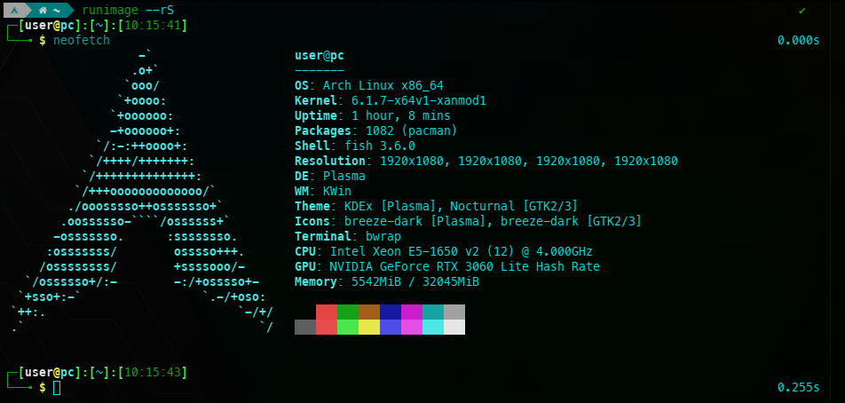

# RunImage

## **Portable single-file unprivileged Linux container in user namespaces.**



RunImage is designed to be completely static and portable to run on almost any Linux. It is based on a specially configured [Arch Linux rootfs](https://github.com/VHSgunzo/runimage-rootfs/releases). The technology of single-file containerization is based on a modified static AppImage [runtime](https://github.com/VHSgunzo/runimage-runtime-static), squashfs image with `lz4` compression method for better work speed, statically compiled [binaries](https://github.com/VHSgunzo/runimage-static/releases) for the operation of the container [Run.sh script](https://github.com/VHSgunzo/runimage/blob/main/Run.sh), and containerization itself is carried out by [statically compiled](https://github.com/VHSgunzo/bubblewrap-static/releases) [Bubblewrap](https://github.com/containers/bubblewrap).

In addition, RunImage has the ability to isolate itself from the main system, use separate portable home directories and configuration files for each executable file being run, and run separate `X11` servers, including running multiple `Xorg` servers on `TTY`. `XFCE` is used as `DE`.

You can use it to develop and run any applications and games, including applications and games for Windows, launch games from retro platforms using popular emulators, work with the office, with remote desktops, multimedia, browsers, messengers, and even run virtual machines with QEMU/KVM and Virt-Manager, USB and block device forwarding in VM also works.

Also inside the container, you can use various means of proxification, such as proxychains, tor and others and run VNC and SSH servers.

The full list of installed packages can be found in the [**releases**](https://github.com/VHSgunzo/runimage/releases) file `pkg_list-{release_type}.txt`

## Features:

* A Portable single executable file with an idea - downloaded and launched. Nothing needs to be installed in the system.
* Works on most Linux distributions, including even very old ones or without `glibc` or `systemd` and in `live` boot mode.
* `OverlayFS` mode (It looks like the usual means of containerization like docker) (See [Usage](https://github.com/VHSgunzo/runimage#usage-from-runimage-help))
* Read-Write mount in OverlayFS mode.
* Private `network sandbox`.
* Running and working without root rights, including package management in unpacked form or in OverlayFS mode.
* The ability to work in a `packed` and `unpacked` form.
* The ability to run both `32-bit` and `64-bit` executable files.
* Based on `Arch Linux`, contains the latest software and [AUR](https://aur.archlinux.org) support.
* Access to [BlackArch](https://github.com/BlackArch/blackarch) repositories.
* Updating packages without extracting runimage and automatic rebuild if the update was successful.
* Ability to exec commands at the host level (see ENABLE_HOSTEXEC and [hostexec](https://github.com/VHSgunzo/runimage/blob/main/rootfs/usr/bin/hostexec))
* The ability to use both separate `home` directories for each `executable` file, and completely `seamless` use of the `system` `home` directory.
* The ability to use separate `configuration` files for each launched `executable` file (see [config](https://github.com/VHSgunzo/runimage/tree/main/config))
* There is no `performance` drawdown. All applications and executable files run at the same `speed` as in the `system`.
* Supports filesystem and `X11` sandboxing.
* `Temporary` `home` directory in `RAM` (can be used as a real private mode for browsers and applications)
* `Sandbox` and `portable` `home` directory.
* The ability to launching a full `DE` in `windowed` mode and on `TTY`.
* Works with any versions of `nvidia` proprietary `drivers`.
* Works in `Wayland` session.
* `Monitoring` of running `processes`.
* Background `processes` control.
* `Attaching` to a running `containers`.
* Usability and comprehensibility.

## Requirements:

* Supported architectures (should work on any Linux kernel architecture. However, it is currently only built for `x86_64`)
* Minimum recommended Linux `kernel` version `4.18+` (tested on Centos 7 with `3.10` and on Ubuntu 12.04 with `3.11` using `SUID Bubblewrap` and it's works, but `5.0+` with [user namespaces](https://lwn.net/Articles/531114) support is recommended)
* `FUSE` (but not necessarily, because it is possible to work in unpacked form without `FUSE` mounting). Also you can create `/dev/fuse` manually (as root) if the kernel module exists (see this [code](https://github.com/libfuse/libfuse/blob/f0e08cc700d629da2d46def8b620b0ed858cc0d9/util/install_helper.sh#L35)):
```
mknod /dev/fuse -m 0666 c 10 229
```

## To get started:

1. Download latest release from the [**releases**](https://github.com/VHSgunzo/runimage/releases) page.
2. Make it executable before run.
```
chmod +x runimage*
```

## Usage (from RunImage help):

```
┌──[user@host]─[~]
└──╼ $ runimage {bubblewrap args} {executable} {executable args}

    --run-help   |--rH                    Show this usage info
    --run-bwhelp |--rBwh                  Show Bubblewrap usage info
    --run-version|--rV                    Show runimage, rootfs, static, runtime version
    --run-pkglist|--rP                    Show packages installed in runimage
    --run-binlist|--rBin                  Show /usr/bin in runimage
    --run-shell  |--rS  {args}            Run runimage shell or execute a command in runimage shell
    --run-desktop|--rD                    Launch runimage desktop
    --overfs-list|--oL                    Show the list of runimage OverlayFS
    --overfs-rm  |--oR  {id id ...|all}   Remove OverlayFS
    --run-build  |--rB  {build args}      Build new runimage container
    --run-update |--rU  {build args}      Update packages and rebuild runimage
    --run-kill   |--rK                    Kill all running runimage containers
    --run-procmon|--rPm {RUNPIDs}         Monitoring of processes running in runimage containers
    --run-attach |--rA  {RUNPID} {args}   Attach to a running runimage container or exec command

Only for not extracted (RunImage runtime options):
    --runtime-extract {pattern}          Extract content from embedded filesystem image
    --runtime-extract-and-run {args}     Run runimage afer extraction without using FUSE
    --runtime-help                       Show runimage runtime help (Shown in this help)
    --runtime-mount                      Mount embedded filesystem image and print
    --runtime-offset                     Print byte offset to start of embedded
    --runtime-portable-home              Create a portable home folder to use as $HOME
    --runtime-portable-config            Create a portable config folder to use as $XDG_CONFIG_HOME
    --runtime-version                    Print version of runimage runtime

Environment variables to configure:
    NO_NET=1                             Disables network access
    TMP_HOME=1                           Creates tmpfs /home/$USER and /root in RAM and uses it as $HOME
    TMP_HOME_DL=1                        As above, but with binding $HOME/Downloads directory
    SANDBOX_HOME=1                       Creates sandbox home directory and bind it to /home/$USER or to /root
    SANDBOX_HOME_DL=1                    As above, but with binding $HOME/Downloads directory
    SANDBOX_HOME_DIR="/path/dir"         Specifies sandbox home directory and bind it to /home/$USER or to /root
    PORTABLE_HOME=1                      Creates a portable home directory and uses it as $HOME
    PORTABLE_HOME_DIR="/path/dir"        Specifies a portable home directory and uses it as $HOME
    PORTABLE_CONFIG=1                    Creates a portable config directory and uses it as $XDG_CONFIG_HOME
    NO_CLEANUP=1                         Disables unmounting and cleanup mountpoints
    ALLOW_BG=1                           Allows you to run processes in the background
    UNSHARE_PIDS=1                       Unshares all host processes
    UNSHARE_USERS=1                      Don't bind-mount /etc/{passwd,group}
    SHARE_SYSTEMD=1                      Shares SystemD from the host
    UNSHARE_DBUS=1                       Unshares DBUS from the host
    UNSHARE_UDEV=1                       Unshares UDEV from the host (/run/udev)
    UNSHARE_MODULES=1                    Unshares kernel modules from the host (/usr/lib/modules)
    UNSHARE_DEF_MOUNTS=1                 Unshares default mount points (/mnt /media /run/media)
    NO_NVIDIA_CHECK=1                    Disables checking the nvidia driver version
    NVIDIA_DRIVERS_DIR="/path/dir"       Specifies custom Nvidia driver images directory
    RUNCACHEDIR="/path/dir"              Specifies custom runimage cache directory
    SQFUSE_REMOUNT=1                     Remounts the container using squashfuse (fix MangoHud and VkBasalt bug)
    OVERFS_MODE=1                        Enables OverlayFS mode
    KEEP_OVERFS=1                        Enables OverlayFS mode with saving after closing runimage
    OVERFS_ID=ID                         Specifies the OverlayFS ID
    KEEP_OLD_BUILD=1                     Creates a backup of the old RunImage when building a new one
    BUILD_WITH_EXTENSION=1               Adds an extension when building (compression method and rootfs type)
    CMPRS_ALGO={zstd|xz|lz4}             Specifies the compression algo for runimage build
    ZSDT_CMPRS_LVL={1-19}                Specifies the compression ratio of the zstd algo for runimage build
    NO_RUNDIR_BIND=1                     Disables binding RunDir to /var/RunDir
    RUN_SHELL="shell"                    Selects $SHELL in runimage
    NO_CAP=1                             Disables Bubblewrap capabilities (Default: ALL, drop CAP_SYS_NICE)
                                            you can also use /usr/bin/nocap in runimage
    AUTORUN="{executable} {args}"        Run runimage with autorun options for /usr/bin executables
    ALLOW_ROOT=1                         Allows to run runimage under root user
    QUIET_MODE=1                         Disables all non-error runimage messages
    NO_WARN=1                            Disables all warning runimage messages
    DONT_NOTIFY=1                        Disables all non-error runimage notification
    RUNTIME_EXTRACT_AND_RUN=1            Run runimage afer extraction without using FUSE
    TMPDIR="/path/{TMPDIR}"              Used for extract and run options
    RUNIMAGE_CONFIG="/path/{config}"     runimage сonfiguration file (0 to disable)
    ENABLE_HOSTEXEC=1                    Enables the ability to execute commands at the host level
    NO_RPIDSMON=1                        Disables the monitoring thread of running processes
    SANDBOX_NET=1                        Creates a network sandbox
    SANDBOX_NET_SHARE_HOST=1             Creates a network sandbox with access to host loopback
    SANDBOX_NET_CIDR=11.22.33.0/24       Specifies tap interface subnet in network sandbox (Def: 10.0.2.0/24)
    SANDBOX_NET_TAPNAME=tap0             Specifies tap interface name in network sandbox (Def: eth0)
    SANDBOX_NET_MAC=B6:40:E0:8B:A6:D7    Specifies tap interface MAC in network sandbox (Def: random)
    SANDBOX_NET_MTU=65520                Specifies tap interface MTU in network sandbox (Def: 1500)
    SANDBOX_NET_HOSTS="file"             Binds specified file to /etc/hosts in network sandbox
    SANDBOX_NET_RESOLVCONF="file"        Binds specified file to /etc/resolv.conf in network sandbox
    BWRAP_ARGS+=()                       Array with Bubblewrap arguments (for config file)
    EXEC_ARGS+=()                        Array with Bubblewrap exec arguments (for config file)
    XORG_CONF="/path/xorg.conf"          Binds xorg.conf to /etc/X11/xorg.conf in runimage (0 to disable)
                                            (Default: /etc/X11/xorg.conf bind from the system)
    XEPHYR_SIZE="HEIGHTxWIDTH"           Sets runimage desktop resolution (Default: 1600x900)
    XEPHYR_DISPLAY=":9999"               Sets runimage desktop $DISPLAY (Default: :1337)
    XEPHYR_FULLSCREEN=1                  Starts runimage desktop in full screen mode
    UNSHARE_CLIPBOARD=1                  Disables clipboard synchronization for runimage desktop

    SYS_BWRAP=1                          Using system bwrap
    SYS_SQFUSE=1                         Using system squashfuse
    SYS_UNSQFS=1                         Using system unsquashfs
    SYS_MKSQFS=1                         Using system mksquashfs
    SYS_UNIONFS=1                        Using system unionfs
    SYS_SLIRP=1                          Using system slirp4netns
    SYS_TOOLS=1                          Using all binaries from the system
                                         If they are not found in the system - auto return to the built-in

Other environment variables:
    RunImage path (for packed):
        RUNIMAGE=""
    Squashfs offset (for packed):
        RUNOFFSET=""
    Null argument:
        ARGV0=""
    PID of Run.sh script:
        RUNPID=""
    Parent PID of Run.sh script:
        RUNPPID=""
    Run binary directory:
        RUNDIR=""
    RootFS directory:
        RUNROOTFS=""
    Static binaries directory:
        RUNSTATIC=""
    RunImage or RunDir directory:
        RUNIMAGEDIR=""
    RunImage external configs directory:
        RUNCONFIGDIR=""
    Sandbox homes directory:
        SANDBOXHOMEDIR=""
    Portable homes directory:
        PORTABLEHOMEDIR=""
    Cache directory:
        RUNCACHEDIR=""
    Nvidia driver images directory:
        NVIDIA_DRIVERS_DIR=""
    RunImage name or link name or executable name:
        RUNSRCNAME=""
    RunImage version:
        RUNIMAGE_VERSION=""
    RootFS version:
        RUNROOTFS_VERSION=""
    Static version:
        RUNSTATIC_VERSION=""
    RunImage runtime version:
        RUNRUNTIME_VERSION=""
    Directory for all OverlayFS:
        RUNOVERFSDIR=""
    OverlayFS ID directory:
        OVERFS_DIR=""
    OverlayFS ID mount directory:
        OVERFS_MNT=""
    RunImage runtime:
        RUNRUNTIME=""
    Rootfs type:
        RUNROOTFSTYPE=""
    squashfuse and unionfs PIDs:
        FUSE_PIDS=""
    The name of the user who runs runimage:
        RUNUSER=""
    mksquashfs:
        MKSQFS=""
    unsquashfs:
        UNSQFS=""
    unionfs:
        UNIONFS=""
    squashfuse:
        SQFUSE=""
    bwrap:
        BWRAP=""
    slirp4netns:
        SLIRP=""

Custom scripts and aliases:
    /bin/cip                          Сheck public ip
    /bin/dbus-flmgr                   Launch the system file manager via dbus
    /bin/nocap                        Disables container capabilities
    /bin/pac                          sudo pacman (fake sudo)
    /bin/packey                       sudo pacman-key (fake sudo)
    /bin/panelipmon                   Shows information about an active network connection
    /bin/runbuild                     Starts the runimage build
    /bin/rundesktop                   Starts the desktop mode
    /bin/{xclipsync,xclipfrom}        For clipboard synchronization in desktop mode
    /bin/webm2gif                     Convert webm to gif
    /bin/transfer                     Upload file to https://transfer.sh
    /bin/rpidsmon                     For monitoring of processes running in runimage containers
    /bin/hostexec                     For execute commands at the host level (see ENABLE_HOSTEXEC)
    /usr/bin/runupdate                For runimage update

    ls='ls --color=auto'
    dir='dir --color=auto'
    grep='grep --color=auto'
    vdir='vdir --color=auto'
    fgrep='fgrep --color=auto'
    egrep='egrep --color=auto'
    rm='rm -i'
    cp='cp -i'
    mv='mv -i'
    ll='ls -lh'
    la='ls -lha'
    l='ls -CF'
    em='emacs -nw'
    _='sudo'
    _i='sudo -i'
    please='sudo'
    fucking='sudo'
    cip='curl -s ifconfig.io 2>/dev/null'
    dd='dd status=progress'
    pac='sudo pacman'
    pacman='sudo pacman'
    pacman-key='sudo pacman-key'
    packey='sudo pacman-key'

Additional information:
    You can create a symlink/hardlink to runimage or rename runimage and give it the name
        of some executable file from /usr/bin in runimage, this will allow you to run
        runimage in autorun mode for this executable file.
    The same principle applies to the AUTORUN variable:
        ┌─[user@host]─[~]
        └──╼ $ AUTORUN="ls -la" runimage {autorun executable args}
    Here runimage will become something like an alias for 'ls' in runimage
        with the '-la' argument. You can also use AUTORUN as an array for complex commands in the config.
        AUTORUN=("ls" "-la" "/path/to something")
    This will also work in extracted form for the Run binary.

    When using the PORTABLE_HOME and PORTABLE_CONFIG variables, runimage will create or
        search for these directories next to itself. The same behavior will occur when
        adding a runimage or Run binary or renamed or symlink/hardlink to them in the PATH
        it can be used both extracted and compressed and for all executable files being run:
            '$PORTABLEHOMEDIR/Run'
            '$RUNIMAGEDIR/Run.config'
        if a symlink/hardlink to runimage is used:
            '$PORTABLEHOMEDIR/{symlink/hardlink_name}'
            '$RUNIMAGEDIR/{symlink/hardlink_name}.config'
        or with runimage/Run name:
            '$PORTABLEHOMEDIR/{runimage/Run_name}'
            '$RUNIMAGEDIR/{runimage/Run_name}.config'
        It can also be with the name of the executable file from AUTORUN environment variables,
            or with the same name as the executable being run.
    SANDBOX_HOME* similar to PORTABLE_HOME, but the system HOME becomes isolated.
    SANDBOX_HOME_DIR and PORTABLE_HOME_DIR point to a specific directory or create it in the absence of.

    RunImage uses fakechroot and fakeroot, which allows you to use root commands, including in
        unpacked form, to update the rootfs or install/remove packages.
        sudo and pkexec have also been replaced with fake ones. (see /usr/bin/sudo /usr/bin/pkexec)

    RunImage configuration file:
        Special BASH-syntax file with the .rcfg extension, which describes additional
            instructions and environment variables for running runimage.
        Configuration file can be located next to runimage:
            '$RUNIMAGEDIR/{runimage/Run_name}.rcfg'
        it can be used both extracted and compressed and for all executable files being run:
            '$RUNIMAGEDIR/Run.rcfg'
        if a symlink/hardlink to runimage is used:
            '$RUNIMAGEDIR/{symlink/hardlink_name}.rcfg'
        or in $RUNCONFIGDIR directory:
            '$RUNCONFIGDIR/Run.rcfg'
            '$RUNCONFIGDIR/{runimage/Run_name}.rcfg'
            '$RUNCONFIGDIR/{symlink/hardlink_name}.rcfg'
        It can also be with the name of the executable file from AUTORUN environment variables,
            or with the same name as the executable being run.
        In $RUNDIR/config there are default configs in RunImage, they are run in priority,
            then external configs are run if they are found.

    RunImage desktop:
        Ability to run RunImage in desktop mode. Default DE: XFCE (see /usr/bin/rundesktop)
        If the launch is carried out from an already running desktop, then Xephyr will start
            in windowed mode (see XEPHYR_* environment variables)
            Use CTRL+SHIFT to grab the keyboard and mouse.
        It is also possible to run on TTY with Xorg (see XORG_CONF environment variables)
            To do this, just log in to TTY and run RunImage desktop.
        Important! The launch on the TTY should be carried out only under the user under whom the
            login to the TTY was carried out.

    RunImage OverlayFS:
        Allows you to create additional separate layers to modify the container file system without
            changing the original container file system. Works packed and unpacked. Also, in packed form,
            it allows you to mount the container in RW mode.
        It also allows you to attach to the same OverlayFS when you specify its ID:
        ┌─[user@host]─[~]
        └──╼ $ OVERFS_ID=1337 runimage {args}
            If OverlayFS with such ID does not exist, it will be created.
        To save OverlayFS after closing the container, use KEEP_OVERFS:
        ┌─[user@host]─[~]
        └──╼ $ KEEP_OVERFS=1 runimage {args}
        To run a one-time OverlayFS, use OVERFS_MODE:
        ┌─[user@host]─[~]
        └──╼ $ OVERFS_MODE=1 runimage {args}

    RunImage build:
        Allows you to create your own runimage containers.
        This works both externally by passing build args:
        ┌─[user@host]─[~]
        └──╼ $ runimage --run-build {build args}
        And it also works inside the running instance (see /bin/runbuild):
        ┌─[user@host]─[~] - in runimage
        └──╼ $ runbuild {build args}
        Optionally, you can specify the following build arguments:
            {/path/new_runimage_name} {-zstd|-xz|-lz4} {zstd compression level 1-19}
        By default, runimage is created in the current directory with a standard name and
            with lz4 compression. If a new RunImage is successfully build, the old one is deleted.
            (see KEEP_OLD_BUILD BUILD_WITH_EXTENSION CMPRS_ALGO ZSDT_CMPRS_LVL)

    RunImage update:
        Allows you to update packages and rebuild RunImage. In unpacked form, automatic build will
            not be performed. When running an update, you can also pass arguments for a new build.
            (see RunImage build) (also see /usr/bin/runupdate)
        ┌─[user@host]─[~]
        └──╼ $ runimage --run-update {build args}
        By default, update and rebuild is performed in $RUNIMAGEDIR

    RunImage network sandbox:
        Allows you to create a private network namespace with slirp4netns and inside the container
            manage routing, create/delete network interfaces, connect to a vpn (checked openvpn
            and wireguard), configure your resolv.conf and hosts, etc. (see SANDBOX_NET*)
        By default, network sandbox created in 10.0.2.0/24 subnet, with eth0 tap name, 10.0.2.100 tap ip,
            1500 tap MTU, and random MAC.

    RunImage hostexec:
        Allows you to run commands at the host level (see ENABLE_HOSTEXEC and /usr/bin/hostexec)
        ┌─[user@host]─[~]
        └──╼ $ ENABLE_HOSTEXEC=1 runimage --run-shell
        ┌─[user@host]─[~] - pass command as args
        └──╼ $ hostexec {hostexec args} {executable} {executable args}
        ┌─[user@host]─[~] - pass command to stdin
        └──╼ $ echo "{executable} {executable args}"|hostexec {hostexec args}
            --help      |-h             Show this usage info
            --shell     |-s  {args}     Launch host shell (socat)
            --superuser |-su {args}     Execute command as superuser
            --terminal  |-t  {args}     Execute command in host terminal

    For Nvidia users with a proprietary driver:
        If the nvidia driver version does not match in runimage and in the host, runimage
            will make an image with the nvidia driver of the required version (requires internet)
            or will download a ready-made image from the github repository and further used as
            an additional module to runimage.
        You can download a ready-made driver image from the releases or build driver image manually:
            https://github.com/VHSgunzo/runimage-nvidia-drivers
        In runimage, a fake version of the nvidia driver is installed by default to reduce the size:
            https://github.com/VHSgunzo/runimage-fake-nvidia-utils
        But you can also install the usual nvidia driver of your version in runimage.
        Checking the nvidia driver version can be disabled using NO_NVIDIA_CHECK variable.
        The nvidia driver image can be located next to runimage:
                '$RUNIMAGEDIR/{nvidia_version}.nv.drv'
            or in $RUNIMAGEDIR/nvidia-drivers (Default):
                '$RUNIMAGEDIR/nvidia-drivers/{nvidia_version}.nv.drv'
            or the driver can be extracted as the directory
                '$RUNIMAGEDIR/nvidia-drivers/{nvidia_version}'
            also, the driver can be in RunImage in a packed or unpacked form:
                '$RUNDIR/nvidia-drivers/{nvidia_version}.nv.drv'   -  image
                '$RUNDIR/nvidia-drivers/{nvidia_version}'          -  directory

Recommendations:
    If the kernel does not support user namespaces, you need to install
        SUID Bubblewrap into the system, or install a kernel with user namespaces support.
        If SUID Bubblewrap is found in the system, it will be used automatically.
    If you use SUID Bubblewrap, then you will encounter some limitations, such as the inability to use
        FUSE in RunImage, without running it under the root user, because the capabilities are
        disabled, and so on. So it would be better for you to install kernel with
        user namespaces support.
    I recommend installing the XanMod kernel (https://xanmod.org), because I noticed that the speed
        of runimage in compressed form on this kernel is much higher due to more correct caching settings
        and special patches.
```

## Build/Rebuild your own runimage in manual mode:

* [Download](https://github.com/VHSgunzo/runimage/releases) base version of the runimage (it's called `runimage`)
* Make it executable:
```
chmod +x runimage
```
* Run it in `OverlayFS` mode (If you are using a proprietary nvidia driver, then I recommend disabling the driver check function by `NO_NVIDIA_CHECK=1` for proper build/rebuild in manual mode. You do not need to do this in automatic mode):
```
OVERFS_MODE=1 ./runimage --run-shell
echo $OVERFS_MNT
echo $OVERFS_ID
```
* Install or remove the necessary packages, change `$OVERFS_MNT/rootfs`, etc. You can change `$OVERFS_MNT/rootfs` in the standard ways for you. But do not close the container until the moment of build.
* You can also specify your own type of rootfs in `$OVERFS_MNT/rootfs/.type` file, but it's not necessary.
* After all the manipulations with rootfs, create a new runimage using this command in the container (See [Usage](https://github.com/VHSgunzo/runimage#usage-from-runimage-help)):
```
runbuild
```
* Or from another terminal tab (See [Usage](https://github.com/VHSgunzo/runimage#usage-from-runimage-help)):
```
OVERFS_ID=$OVERFS_ID ./runimage --run-build
```
* After the build is completed, you can close the container:
```
exit
# or CTRL-D
```

## Troubleshooting and problem solving:

* By default, all container processes running in the background will be killed after the container is closed, to allow background processes, use the environment variable `ALLOW_BG=1`
* Possible tearing on nvidia in RunImage desktop mode ([solution](https://wiki.archlinux.org/title/NVIDIA/Troubleshooting#Avoid_screen_tearing))
* To start the `SSH server`, `SUID Bubblewrap` or run as root is required
* When unpacked, use the [Run-wrapper](https://github.com/VHSgunzo/Run-wrapper) binary file to properly launch the container.
* If SELinux is enabled in the system, then there may be problems with the launch and operation of Wine ([solution](https://www.tecmint.com/disable-selinux-in-centos-rhel-fedora))
* To start nested bubblewrap containerization, you need to disable capabilities (see NO_CAP env var or use [nocap](https://github.com/VHSgunzo/runimage/blob/main/rootfs/usr/bin/nocap))
```
    NO_CAP=1 runimage {args}
    # or nocap in runimage
    nocap bwrap {args}
    nocap steam {args}
    ...
```
* When using `TMP_HOME`* you may run out of RAM, be careful with this.
* It is also advisable to use `TMPDIR` when using `--runtime-extract-and-run` or `RUNTIME_EXTRACT_AND_RUN`, because by default, unpacking before starting will be carried out in `/tmp`, which may also lead to the end of RAM
* With `UNSHARE_PIDS`, RunImage desktop does not start on TTY.
* `Xephyr` does not support GL acceleration and Vulkan has performance issues (But this is not related to RunImage)
* If you have problems with sound when running RunImage desktop on TTY, just restart pulseaudio.
```
    killall pulseaudio ; pulseaudio -D
```
* If you disable bubblewrap capabilities using `NO_CAP`, you will not be able to use `FUSE` inside the container.
* In packed form for fix bug with `MangoHud` and `vkBasalt` in `DXVK` mode need remount container with `squashfuse` (see `SQFUSE_REMOUNT=1`). In `lwrun` it's enabled by default.
* If `PID_MAX` is less then `4194304`, recommended to increase [PID_MAX](https://www.cyberciti.biz/tips/howto-linux-increase-pid-limits.html) to 4194304 for better stability:
```
sudo sh -c 'echo kernel.pid_max=4194304 >> /etc/sysctl.d/98-pid_max.conf'
sudo sh -c 'echo 4194304 > /proc/sys/kernel/pid_max'
```

## Main used projects:

* [archlinux](https://archlinux.org)
* [bubblewrap-static](https://github.com/VHSgunzo/bubblewrap-static)
* [chaotic-aur](https://aur.chaotic.cx)
* [blackarch](https://github.com/BlackArch/blackarch)
* [runimage-repo](https://github.com/runimage/repo)
* [runimage-repo-hf](https://runimage-repo.hf.space)
* [runimage-mirrorlist](https://github.com/VHSgunzo/runimage-mirrorlist)
* [runimage-fake-nvidia-utils](https://github.com/VHSgunzo/runimage-fake-nvidia-utils)
* [runimage-nvidia-drivers](https://github.com/VHSgunzo/runimage-nvidia-drivers)
* [runimage-rootfs](https://github.com/VHSgunzo/runimage-rootfs)
* [runimage-runtime-static](https://github.com/VHSgunzo/runimage-runtime-static)
* [runimage-static](https://github.com/VHSgunzo/runimage-static)
* [runimage-fake-sudo-pkexec](https://github.com/VHSgunzo/runimage-fake-sudo-pkexec)
* [Run-wrapper](https://github.com/VHSgunzo/Run-wrapper)
* [fake-systemd](https://github.com/VHSgunzo/runimage-fake-systemd)
* [bash-static](https://github.com/robxu9/bash-static)
* [coreutils-static](https://github.com/VHSgunzo/coreutils-static)
* [findutils-static](https://github.com/VHSgunzo/findutils-static)
* [gawk-static](https://github.com/VHSgunzo/gawk-static)
* [grep-static](https://github.com/VHSgunzo/grep-static)
* [gzip-static](https://github.com/VHSgunzo/gzip-static)
* [kmod-static](https://github.com/VHSgunzo/kmod-static)
* [notify-send-rs](https://github.com/VHSgunzo/notify-send-rs)
* [procps-static](https://github.com/VHSgunzo/procps-static)
* [sed-static](https://github.com/VHSgunzo/sed-static)
* [squashfs-tools-static](https://github.com/VHSgunzo/squashfs-tools-static)
* [squashfuse-static](https://github.com/VHSgunzo/squashfuse-static)
* [static-curl](https://github.com/moparisthebest/static-curl)
* [tar-static](https://github.com/VHSgunzo/tar-static)
* [which-static](https://github.com/VHSgunzo/which-static)
* [xorg-xhost-static](https://github.com/VHSgunzo/xorg-xhost-static)
* [xz-static](https://github.com/VHSgunzo/xz-static)
* [minos-static](https://github.com/minos-org/minos-static)
* [unionfs-fuse-static](https://github.com/VHSgunzo/unionfs-fuse-static)
* [importenv](https://github.com/VHSgunzo/importenv/releases)
* [slirp4netns](https://github.com/rootless-containers/slirp4netns/releases)
* [util-linux-static](https://github.com/VHSgunzo/util-linux-static/releases)
* [fakeroot](https://github.com/mackyle/fakeroot)
* [fakechroot](https://github.com/dex4er/fakechroot)
* [ptyspawn](https://github.com/VHSgunzo/ptyspawn)
* [socat-static](https://github.com/VHSgunzo/socat-static)
* [pacutils](https://github.com/andrewgregory/pacutils)

## Projects based on RunImage:

* [Lutris Wine](https://github.com/VHSgunzo/lutris-wine)
* [stable-diffusion](https://github.com/VHSgunzo/stable-diffusion)
* [NitroWine](https://github.com/RusNor/NitroWine)

## Similar projects:

* [Conty](https://github.com/Kron4ek/Conty)

## RunImage tested and works on:

* [Adelie Linux](https://www.adelielinux.org/)
* [AlmaLinux](https://almalinux.org/)
* [Alpine](https://www.alpinelinux.org/)
* [Alt Workstation](https://www.basealt.ru/alt-workstation/description)
* [Antergos](https://en.wikipedia.org/wiki/Antergos)
* [antiX](https://antixlinux.com/)
* [Arch Linux](https://archlinux.org/)
* [ArcoLinux](https://arcolinux.com/)
* [Artix Linux](https://artixlinux.org/)
* [Astra Linux](https://astralinux.ru/)
* [Batocera](https://batocera.org/)
* [Bodhi Linux](https://www.bodhilinux.com/)
* [BlendOS](https://blendos.co/)
* [CachyOS](https://cachyos.org/)
* [Calculate](https://www.calculate-linux.org/)
* [CentOS](https://www.centos.org/)
* [ChromeOS Flex](https://chromeenterprise.google/intl/en_us/os/chromeosflex/)
* [Clear Linux](https://clearlinux.org/)
* [Debian](https://www.debian.org/)
* [Deepin](https://www.deepin.org/)
* [EasyOS](https://easyos.org)
* [ElementaryOS](https://elementary.io/)
* [EndeavourOS](https://endeavouros.com/)
* [EuroLinux](https://en.euro-linux.com/)
* [Fedora Silverblue](https://silverblue.fedoraproject.org/)
* [Fedora Workstation](https://getfedora.org/en/workstation/)
* [Garuda Linux](https://garudalinux.org/)
* [Gentoo](https://www.gentoo.org/)
* [GoboLinux](https://gobolinux.org/)
* [Green Linux](https://greenlinux.ru/)
* [Grml Linux](https://grml.org/)
* [Kali Linux](https://www.kali.org/)
* [KDE neon](https://neon.kde.org/)
* [Kodachi](https://www.digi77.com/linux-kodachi/)
* [Kubuntu](https://kubuntu.org/)
* [Linux Lite](https://www.linuxliteos.com/)
* [Linux Mint](https://linuxmint.com/)
* [Lubuntu](https://lubuntu.me/)
* [Mageia](https://www.mageia.org/)
* [Manjaro](https://manjaro.org/)
* [MX Linux](https://mxlinux.org/)
* [Nitrux nxOS](https://nxos.org/)
* [NixOS](https://nixos.org/)
* [Nobara](https://nobaraproject.org/)
* [openSUSE](https://www.opensuse.org/)
* [Oracle Linux](https://www.oracle.com/linux/)
* [Parrot](https://www.parrotsec.org/)
* [PCLinuxOS](https://www.pclinuxos.com/)
* [PeppermintOS (Devuan)](https://peppermintos.com/)
* [Pop!_OS](https://pop.system76.com/)
* [Porteus](http://www.porteus.org/)
* [Puppy Linux](https://puppylinux.com/)
* [Qubes](https://www.qubes-os.org/)
* [Red OS](https://redos.red-soft.ru/)
* [Rocky Linux](https://rockylinux.org/ru/)
* [ROSA](https://www.rosalinux.ru/)
* [Simply/ALT Linux](https://www.basealt.ru/simplylinux)
* [Slackware](http://www.slackware.com/)
* [Slax Linux](https://www.slax.org/)
* [Solus](https://getsol.us/home/)
* [SparkyLinux](https://sparkylinux.org/)
* [SpiralLinux](https://spirallinux.github.io/)
* [SteamOS (HoloISO)](https://github.com/theVakhovskeIsTaken/holoiso)
* [Tails](https://tails.boum.org/)
* [Ubuntu](https://ubuntu.com/)
* [Ubuntu MATE](https://ubuntu-mate.org/)
* [UBLinux](https://ublinux.ru/)
* [VanillaOS](https://vanillaos.org/)
* [Venom Linux](https://venomlinux.org/)
* [Void Linux](https://voidlinux.org/)
* [Whonix](https://www.whonix.org/)
* [Windowsfx (Linuxfx)](https://www.windowsfx.org/)
* [Windows Subsystem for Linux (WSL 2 on Win 11)](https://learn.microsoft.com/en-us/windows/wsl/install)
* [Xubuntu](https://xubuntu.org/)
* [Zorin OS](https://zorin.com/os/)
